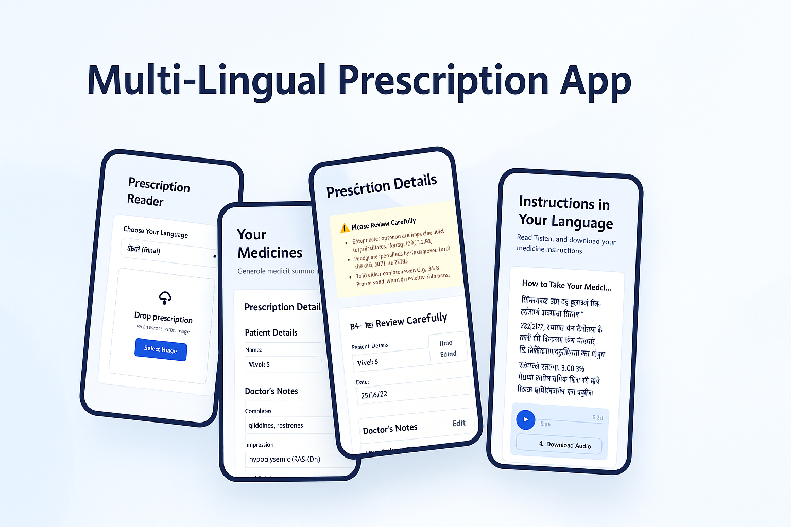
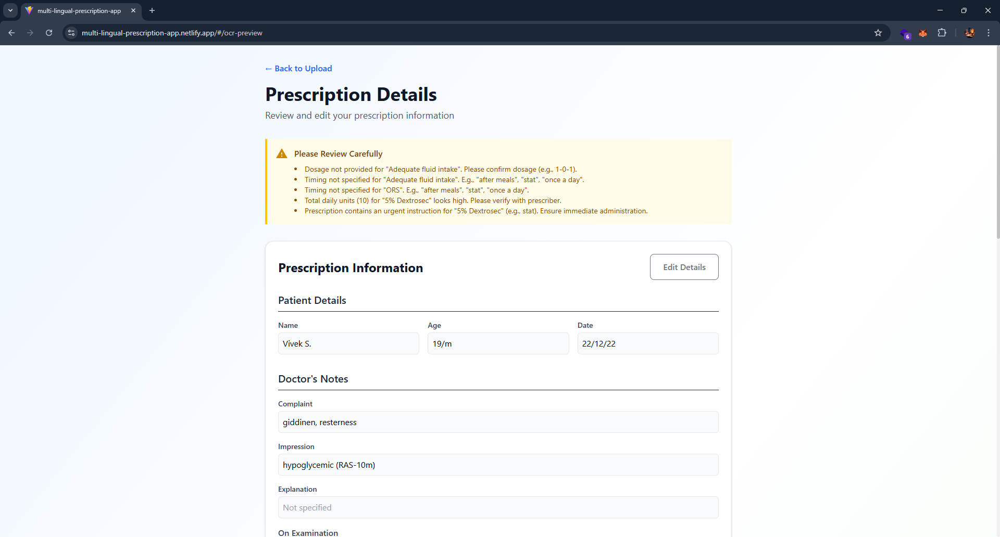
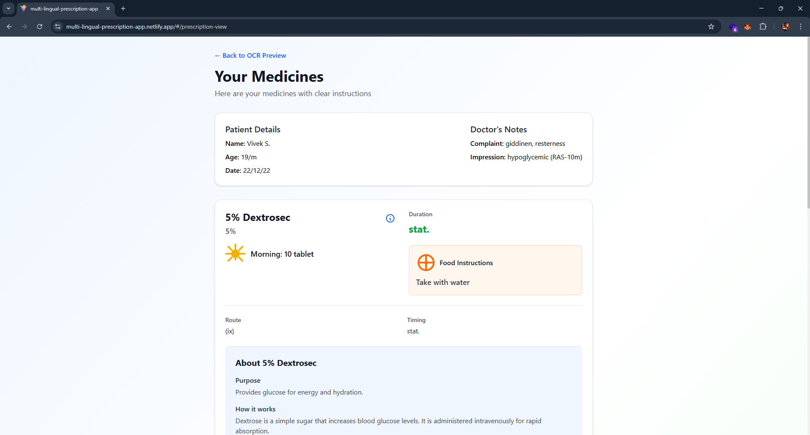
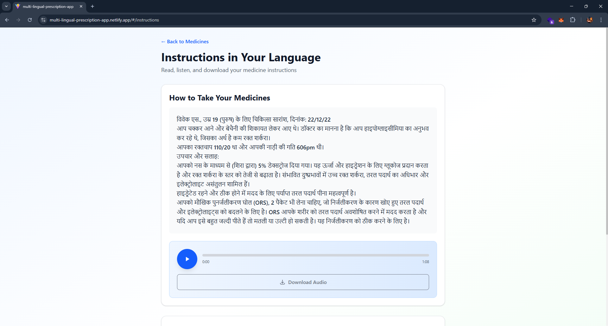

<p align="center">
  
</p>

<h1 align="center" style="font-size:2.5rem; font-weight:700; letter-spacing:2px;">
  Multilingual Prescription Reader
</h1>

<p align="center" style="font-size:1.15rem;">
  <b>AI-Powered Medical Document Processing System</b><br>
  Extracts medical information from prescriptions, structures it into editable JSON, and generates multilingual summaries using advanced AI.
</p>

<p align="center">
  
</p>

<p align="center">
  <a href="https://multilingual-prescription-app.netlify.app" target="_blank">
    
  </a>
</p>

<p align="center">
  
  
  
  
  
</p>

<hr>

## Overview

Multilingual Prescription Reader is a comprehensive web application that leverages AI to extract, structure, and translate medical information from handwritten prescriptions. The system provides an intuitive interface for healthcare professionals and patients to process prescriptions, edit extracted information, and receive clear summaries in multiple languages.

## Key Capabilities

- **AI-Powered OCR**: Extracts medical information from prescription images using Google Gemini Vision API
- **Structured Data**: Converts unstructured prescription text into organized JSON format
- **Editable Interface**: Allows users to review and correct extracted information before generating summaries
- **Medical Summaries**: Generates patient-friendly explanations of medications, including purpose, mechanism, and side effects
- **Multilingual Support**: Translates summaries into multiple languages using Lingo.dev SDK
- **Medicine Information**: Provides detailed information about each prescribed medication
- **Responsive Design**: Works seamlessly on desktop and mobile devices

## Technical Stack

| Layer       | Technology                                         |
| ----------- | -------------------------------------------------- |
| Frontend    | React, TypeScript, Vite, TailwindCSS, React Router |
| Backend     | Node.js, Express.js, Multer, dotenv                |
| AI Services | Google Gemini Vision API, Lingo.dev SDK            |
| Deployment  | Netlify (frontend), Render (backend)               |

---

## Target Users

- **Healthcare Professionals**: Doctors, pharmacists, and medical staff who need to process prescriptions
- **Patients**: Individuals who want to understand their medications in their preferred language
- **Medical Institutions**: Hospitals and clinics requiring efficient prescription processing systems
- **Researchers**: Professionals studying medical document processing and multilingual healthcare applications

---

## User Flow

1. **Upload Prescription**: User uploads a prescription image through the web interface
2. **Language Selection**: User selects their preferred language for the summary
3. **OCR Processing**: System extracts text and structures it into JSON format
4. **Review & Edit**: User reviews and corrects the extracted information
5. **Generate Summary**: System creates a comprehensive medical summary
6. **View Details**: User can view detailed information about each medication
7. **Listen to Summary**: User can listen to the translated summary via audio playback

---

## API Reference

**Base URL**

```
https://multi-lingual-prescription-app.onrender.com/api
```

| Endpoint            | Method | Purpose                           |
| ------------------- | ------ | --------------------------------- |
| `/upload`           | POST   | Upload prescription image         |
| `/generate-summary` | POST   | Generate medical summary          |
| `/warnings`         | POST   | Get prescription warnings         |
| `/medicine-info`    | POST   | Get detailed medicine information |

**Status Codes**

| Code | Refers To                       |
| ---- | ------------------------------- |
| 200  | Successful requests             |
| 400  | Bad request / validation issues |
| 403  | Forbidden / permission denied   |
| 404  | Resource not found              |
| 500  | Server error                    |

---

## Development Status

Features to be implemented or already implemented:

- [x] Prescription image upload
- [x] OCR text extraction with Gemini Vision
- [x] Structured JSON generation
- [x] User-editable prescription data
- [x] Medical summary generation
- [x] Multilingual summary translation
- [x] Medicine information retrieval
- [x] Audio playback of summaries
- [x] Responsive design for all devices
- [ ] Prescription history tracking
- [ ] User authentication system
- [ ] Advanced annotation features
- [ ] Offline mode support

---

## Screenshots

### Prescription Upload

<p align="center">
  
</p>
<p align="center" style="font-size:0.9rem; color:#666;">
  Interface for uploading prescription images with language selection
</p>

### OCR Review & Edit

<p align="center">
  
</p>
<p align="center" style="font-size:0.9rem; color:#666;">
  Structured form for reviewing and correcting extracted prescription information
</p>

### Medicine Details

<p align="center">
  
</p>
<p align="center" style="font-size:0.9rem; color:#666;">
  Detailed medicine information with expandable sections for mechanism and side effects
</p>

### Multilingual Summary

<p align="center">
  
</p>
<p align="center" style="font-size:0.9rem; color:#666;">
  Translated summary with audio playback controls
</p>

---

## Setup Instructions

### Prerequisites

- Node.js version 18 or newer
- npm or yarn package manager
- Google Gemini API key
- Lingo.dev API key

### Installation Steps

**Frontend Setup:**

```bash
# Clone the repository
git clone https://github.com/your-username/multilingual-prescription-reader.git
cd multilingual-prescription-reader

# Install frontend dependencies
npm install

# Start the development server
npm run dev
```

**Backend Setup:**

```bash
# Navigate to the backend directory
cd server

# Install backend dependencies
npm install

# Create environment variables
cp .env.example .env
# Edit .env with your API keys

# Start the backend server
npm run dev
```

### Environment Variables

Create a `.env` file in the backend directory:

```
PORT=5000
UPLOAD_DIR=./uploads
SERVER_URL=http://localhost:5000

# AI Service Keys
GEMINI_API_KEY=YOUR_GEMINI_KEY
LINGODOTDEV_API_KEY=YOUR_LINGO_KEY
```

---

## Usage

1. **Upload a Prescription**:

   - Click on the upload area or drag and drop a prescription image
   - Select your preferred language for the summary
   - Click "Continue to OCR Check"

2. **Review Extracted Data**:

   - Verify the extracted patient details, doctor's notes, and medications
   - Edit any incorrect information using the form fields
   - Click "Continue to Prescription View"

3. **View Medication Details**:

   - Review all medications in an organized card layout
   - Click the info icon to expand detailed information about each medication
   - Click "Get Audio Instructions in Your Language"

4. **Listen to Summary**:
   - Read the translated summary in your preferred language
   - Use the audio player to listen to the summary
   - Download the audio file if needed

---

## Contributors

[](https://github.com/Mohammedvaraliya)
[](https://github.com/v4vraj)

---

## Acknowledgments

- Google Gemini Vision API for OCR capabilities
- Lingo.dev for multilingual translation services
- React and Vite for the frontend framework
- Express.js for the backend framework
- TailwindCSS for styling utilities

---
